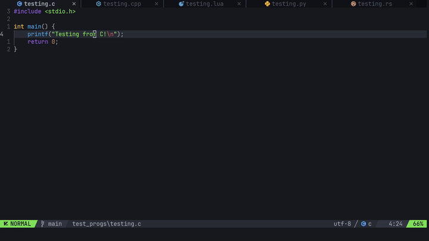

# neocoderunner.nvim

A lightweight plugin to help run quick test pieces of code, inspired by VSCode's code runner.



## Concept
This is a plugin that should be used when you quickly want to test a small piece of code very quickly.

Simply run the command `:RunCurrentFile` and the file compiles, executes and opens in a new buffer,
preventing the hassle of opening the terminal, compiling and running.

## Requirements
Here are the commands executed for each language, use them to find what you need to run each:
```
C
gcc -o ${fileName} ${fullpath} && ./${fileName}

C++
g++ -o ${fileName} ${fullpath} && ./${fileName}

Rust
rustc ${fullpath} && ./${fileName}

Lua
lua ${fullpath}

Python
python -u ${fullpath}

Javascript
node ${fullpath}

Typescript
npx tsx ${fullpath}
```
**Note these aren't the actual commands that are run, rather only a repreesentation of the commands behind the scenes. The actual commands depend on teh device being used.


## Setup
**lazy**:
```lua
{
    "abdallahsoliman00/neocoderunner.nvim",
    opts = {
        -- Easy run with keymap (optinal)
        vim.keymap.set("n", "<C-S-N>", ":RunCurrentFile<CR>", { silent = true, noremap = true } )
    }
}
```

**packer**:
```lua
use({
    "abdallahsoliman00/neocoderunner.nvim",
    config = function()
        require("neocoderunner").setup({
            -- Easy run with keymap (optinal)
            vim.keymap.set("n", "<C-S-N>", ":RunCurrentFile<CR>", { silent = true, noremap = true } )
        })
    end
})
```


## Default Configuration
```lua
{
    -- Position of the neocoderunner terminal
    terminal_position = "floating",    -- other options include "top", "floating", "left", "right"

    -- How much of the existing window the neocoderunner terminal will occupy
    terminal_footprint = 0.33,
}
```

## Contributing
I haven't yet implemented all lanuages, but the most commonly used ones (that can easily be run) are supported.

See [this file](lua/neocoderunner/languages) or the [Requirements](#Requirements) section for more.
