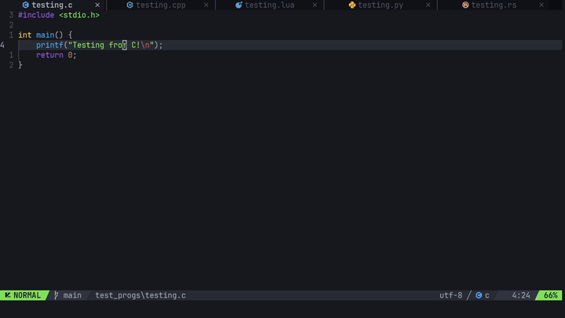

# neocoderunner.nvim

A lightweight plugin to make running your code so much easier. A plugin to stremilne everything that isn't coding.

The aim of this plugin is to make the whole build and run process seemless by making them only a single command away.
Configure once, and run forever.

(Inspired by VSCode's code runner.)



## Overview
By default, this plugin provides a quick way to test a small piece of code very quickly. Either run the whole file, or highlight a section and run that.

However, a custom configuration can be made to tailor the plugin specifically for the project in the nvim working directory, making it also useful for handling large run workflows.
See the [Runner Configuration](#runner-configuration) section to see how to configure this plugin per project and to understand what the explanations below refer to.

The plugin provides five commands:
- `:NCRunnerBuild` - Runs the build command for the filetype of the file in the current buffer, if defined.
- `:NCRunnerRun` - Runs the run command for the filetype of the file in the current buffer.
- `:RunCurrentFile` - Runs both the build and run commands in one sweep.
- `:RunCodeSnippet` - Runs a visually selected snippet by writing it to a temporary file, executing it, then cleaning up automatically.
- `:InitRunnerConfig` - Creates and initialises the file where the current working directory's configuration will be configured.

All commands are best mapped to keybinds for the smoothest workflow. (See the [Setup](#setup) section.)


## Setup
**lazy**:
```lua
{
    "abdallahsoliman00/neocoderunner.nvim",
    opts = {
        terminal_position = "bottom",
        terminal_footprint = 0.33,
    },
    keys = {
        -- Easy run with keymaps (optional)
        { "<C-S-B>", ":NCRunnerBuild<CR>", mode = "n", silent = true, noremap = true },
        { "<C-S-R>", ":NCRunnerRun<CR>", mode = "n", silent = true, noremap = true },
        { "<C-S-N>", ":RunCurrentFile<CR>", mode = "n", silent = true, noremap = true },
        { "<C-S-N>", ":<C-U>RunCodeSnippet<CR>", mode = "v", silent = true, noremap = true },
    },
}
```

**packer**:
```lua
use({
    "abdallahsoliman00/neocoderunner.nvim",
    config = function()
        require("neocoderunner").setup({
            terminal_position = "bottom",
            terminal_footprint = 0.33,
        })
        -- Easy run with keymap (optional)
        vim.keymap.set("n", "<C-S-B>", ":NCRunnerBuild<CR>", { silent = true, noremap = true } },
        vim.keymap.set("n", "<C-S-R>", ":NCRunnerRun<CR>", { silent = true, noremap = true } },
        vim.keymap.set("n", "<C-S-N>", ":RunCurrentFile<CR>", { silent = true, noremap = true })
        vim.keymap.set("v", "<C-S-N>", ":<C-U>RunCodeSnippet<CR>", { silent = true, noremap = true })
    end
})
```


## Default Configuration
```lua
{
    -- Position of the neocoderunner terminal
    terminal_position = "bottom",    -- other options include "top", "floating", "left", "right"

    -- How much of the existing window the neocoderunner terminal will occupy
    terminal_footprint = 0.33,
}
```


## Runner Configuration
By default, the following are the commands that are run when the file open in the current buffer is run:
```
C
gcc -o ${fileName} ${filePath} && ./${fileName}

C++
g++ -o ${fileName} ${filePath} && ./${fileName}

Rust
rustc ${filePath} && ./${fileName}

Lua
lua ${filePath}

Python
python -u ${filePath}

Javascript
node ${filePath}

Typescript
npx tsx ${filePath}

Perl
perl ${filePath}

Go
go run ${filePath}

Zig
zig run ${filePath}

PHP
php ${filePath}
```
*Note: The exact commands that are run depend on the shell being used, but the above are a close approximation and are the ones run in a bash shell.
And don't worry, thew plugin detects the shell and adjusts the default commands accordingly.

### Setup
To configure the runner for each filetype, the command `:InitRunnerConfig` can be used to generate a json file
(at `{root}/.ncrunner/runners.json`) containing the default commands and environment used. The resulting json should look something like this:
```json
{
    "env": {
        "cd": "${cwd}",
        "export": {},
        "scripts": []
    },
    "runners": {
        "global": "",
        "c": "gcc -o ${fileName} ${filePath} && ./${fileName}",
        "cpp": "g++ -o ${fileName} ${filePath} && ./${fileName}",
        "lua": "lua ${filePath}",
        "python": "python3 -u ${filePath}",
        "rust": "rustc ${filePath} && ./${fileName}",
        "javascript": "node ${filePath}",
        "typescript": "npx tsx ${filePath}",
        "perl": "perl ${filePath}",
        "go": "go run ${filePath}",
        "php": "php ${filePath}",
        "zig": "zig run ${filePath}"
    }
}
```
Alternatively, you could just create a file at `{root}/.ncrunner/runners.json` and just write the runner for whatever filetype you want.
```json
{
    "cpp": {
        "build": "cmake --build build",
        "run": "build/out.exe"
    }
}
```
Yes, the `"env"` section is optional.

### Configuration Syntax
In the above example, you will see some placeholder names `${cwd}`, `${fileName}`, `${filePath}`. These are the placeholders that this plugin understands,
so when writing your own runner configuration, use a combination of these to help.
- `${cwd}`: Stands for 'Current Working Directory' and it is the directory that your neovim instance is in, and it is where the `.ncrunner` file should exist.
- `${fileName}`: Is the name of whatever file is open in your current buffer at the time the command is executed.
  For example, if a file called `src/myfile.c` is open in your current buffer, at runtime, `${fileName}` will resolve to just `myfile`.
- `${filePath}`: Is the path relative to the current working directory, so `src/myfile.c` will be `src/myfile.c`.


## Contributing
I haven't yet added runner commands for all languages, but the most commonly used ones (that don't have a complicated build system) are supported.

See [this file](lua/neocoderunner/languages.lua) or the [Requirements](#Requirements) section for more.

If there's a language I missed, or a feature to add, feel free to open a pull request.
